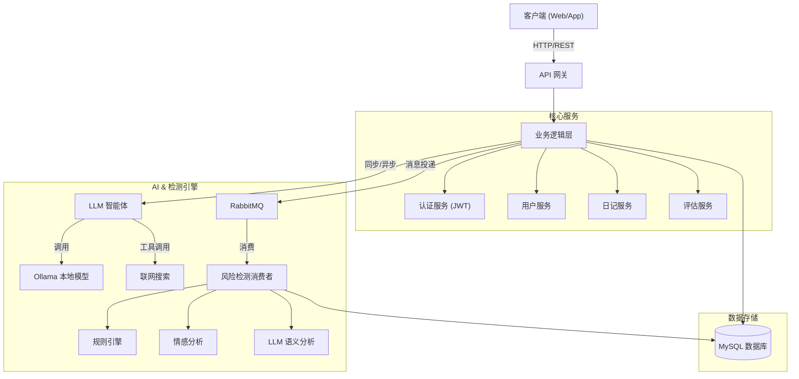

# Digital Companion Server

这是一个基于 Spring Boot 3.4.0 和 Java 21 构建的后端服务项目，旨在提供数字伴侣/心理健康辅助相关的服务。项目集成了用户管理、抑郁评估、日记记录、音乐推荐以及基于 LLM (Ollama) 的 AI 对话功能。

此外，本项目还包含一个配套的 TypeScript SDK (`Client/` 目录)，方便前端应用（Web/Node/Tauri）快速接入。

## ✨ 主要功能

*   **用户系统**
    *   🔐 **安全认证**: 基于 JWT 的无状态认证机制，支持 Token 自动刷新与黑名单管理。
    *   👤 **个人中心**: 完整的用户画像管理，包括头像、签名、个性化偏好设置。
    *   📧 **邮件服务**: 集成邮件通知服务，用于账号验证与风险预警。
*   **心理健康与评估**
    *   📊 **专业量表**: 内置 PHQ-9 等专业抑郁评估量表，提供科学的评分与分析。
    *   🧠 **心理知识库**: 结构化的心理学知识管理系统，支持知识检索与科普。
    *   🛡️ **多模态风险检测**: 结合规则引擎、情感分析与 LLM 语义识别的混合检测机制。
*   **AI 伴侣 (LLM)**
    *   🤖 **智能对话**: 集成 Ollama 本地大模型，提供流畅的情感陪伴与对话。
    *   🌐 **联网能力**: 支持 Web Search 与网页内容抓取，赋予 AI 实时获取信息的能力。
    *   💾 **会话记忆**: 完整的会话历史记录与上下文管理。
*   **生活记录**
    *   📔 **情绪日记**: 记录日常点滴与心情变化，支持情绪趋势分析。
*   **社区与娱乐**
    *   👥 **互助社区**: 匿名或实名的社区互动空间。
    *   🎵 **音乐疗愈**: 基于用户情绪状态推荐舒缓音乐。
*   **管理后台**
    *   🛠️ **系统管理**: 用户管理、内容审核、系统监控等管理员功能。

## 🏗 系统架构



## 💡 核心特性深度解析

### 1. 多模态风险检测引擎

系统采用三层防护机制来实时监测用户的心理健康状态：

*   **Layer 1: 规则引擎 (`RuleBasedRiskDetector`)**
    *   基于关键词匹配和正则表达式，快速识别明显的自杀倾向或高危言论。
    *   响应速度最快，作为第一道防线。
*   **Layer 2: 情感分析 (`EmotionRiskDetector`)**
    *   分析文本的情感极性（Polarity）和强度。
    *   识别持续的负面情绪波动。
*   **Layer 3: LLM 语义分析 (`LlmRiskDetector`)**
    *   利用大模型的深度语义理解能力，识别隐晦的求救信号或复杂的心理困扰。
    *   结合上下文历史，进行综合判断。

### 2. 异步处理架构 (RabbitMQ)

为了保证用户对话的流畅性，耗时的风险检测任务被剥离到异步消息队列中处理：

*   **消息流转**: 用户发送消息 -> 存入数据库 -> 投递到 RabbitMQ -> 立即响应用户。
*   **可靠性**: 采用持久化队列和死信队列 (DLQ) 机制，确保检测任务不丢失。
*   **削峰填谷**: 在高并发场景下，有效缓冲检测请求，保护后端服务。

### 3. 智能体工作流 (Agent Workflow)

AI 伴侣不仅仅是一个聊天机器人，它具备使用工具的能力：

*   **Web Search**: 当用户询问时事新闻或特定知识时，AI 会自动调用搜索工具。
*   **Content Fetch**: 获取搜索结果的详细网页内容，进行阅读理解和总结。
*   **工作流**: `用户提问` -> `意图识别` -> `调用搜索` -> `阅读内容` -> `生成回答`。

## 🛠 技术栈

*   **编程语言**: Java 21
*   **核心框架**: Spring Boot 3.4.0
*   **持久层**: MyBatis 3.0.4
*   **数据库**: MySQL 8.0
*   **安全框架**: Spring Security (JWT)
*   **AI/LLM**: Ollama 集成
*   **构建工具**: Maven
*   **容器化**: Docker & Docker Compose (用于数据库部署)

## 📂 项目结构

```
Server/
├── Client/                 # TypeScript SDK 源码及文档
├── docs/                   # 详细项目文档 (JWT, Admin, Guides等)
├── sql/                    # 数据库初始化与迁移脚本
├── src/
│   ├── main/
│   │   ├── java/dev/x/     # Java 源代码
│   │   │   ├── controller/ # API 控制器
│   │   │   ├── service/    # 业务逻辑
│   │   │   ├── mapper/     # MyBatis Mapper
│   │   │   ├── entity/     # 数据库实体
│   │   │   ├── llm/        # LLM 集成模块
│   │   │   └── ...
│   │   └── resources/
│   │       ├── application.yml # 项目配置
│   │       └── prompt/     # LLM 提示词模板
├── docker-compose.yml      # MySQL 部署配置
├── pom.xml                 # Maven 依赖配置
└── README.md               # 项目说明
```

## 🚀 快速开始

### 前置要求

*   JDK 21+
*   Maven 3.x
*   Docker & Docker Compose
*   Ollama (如果需要使用 AI 功能)

### 1. 启动数据库

项目根目录下提供了 `docker-compose.yml` 文件，可快速启动 MySQL 服务。

```bash
docker-compose up -d
```

默认配置：
*   端口: `3306`
*   数据库名: `digital_companion`
*   Root 密码: `passwd`

### 2. 配置项目

修改 `src/main/resources/application.yml` 文件，配置你的数据库连接和邮件服务信息：

```yaml
spring:
  datasource:
    url: jdbc:mysql://127.0.0.1:3306/digital_companion
    username: root
    password: passwd # 请确保与 docker-compose 中一致
  mail:
    host: smtp.qq.com # 你的邮件服务器
    username: your_email@example.com
    password: your_password
```

### 3. 编译与运行

```bash
# 编译项目
mvn clean install

# 运行项目
mvn spring-boot:run
```

服务启动后，默认运行在 `8080` 端口（具体视配置而定）。

## ⚙️ 配置详解

### 环境变量

项目支持通过环境变量覆盖默认配置，方便容器化部署：

| 变量名 | 默认值 | 说明 |
| :--- | :--- | :--- |
| `SPRING_DATASOURCE_URL` | `jdbc:mysql://127.0.0.1:3306/digital_companion` | 数据库连接地址 |
| `SPRING_DATASOURCE_USERNAME` | `root` | 数据库用户名 |
| `SPRING_DATASOURCE_PASSWORD` | `password` | 数据库密码 |
| `SPRING_MAIL_HOST` | `smtp.qq.com` | SMTP 服务器地址 |
| `SPRING_MAIL_USERNAME` | `Hughsean@qq.com` | 发件人邮箱 |
| `SPRING_MAIL_PASSWORD` | `lrgbulnorlvwbaii` | 邮箱授权码 |
| `SPRING_RABBITMQ_HOST` | `localhost` | RabbitMQ 主机 |
| `SPRING_RABBITMQ_PORT` | `5672` | RabbitMQ 端口 |
| `SPRING_RABBITMQ_USERNAME` | `guest` | RabbitMQ 用户名 |
| `SPRING_RABBITMQ_PASSWORD` | `guest` | RabbitMQ 密码 |

### RabbitMQ 配置

如果启用了异步风险检测，请确保 RabbitMQ 服务已启动，并创建了相应的 Exchange 和 Queue（系统启动时会自动尝试创建）：

*   **Exchange**: `risk.detection.exchange` (Direct)
*   **Queue**: `risk.detection.queue`
*   **Routing Key**: `risk.detection`

## 📦 Client SDK

项目包含一个自动生成的 TypeScript SDK，位于 `Client/` 目录下。它提供了类型安全的 API 调用方式，支持 Browser、Node.js 和 Tauri 环境。

**安装与使用：**

请参考 [Client/README.md](Client/README.md) 获取详细的安装和使用指南。

```typescript
import { UsersApi, updateApiConfig } from './Client/src';

// 配置 API 地址
updateApiConfig({ baseURL: 'http://localhost:8080' });

// 调用 API
const users = new UsersApi();
const user = await users.getById(1);
```

## 📚 文档

更多详细文档请查阅 `docs/` 目录：

*   [JWT 认证指南](docs/JWT_AUTHENTICATION_GUIDE.md)
*   [管理员 API 指南](docs/ADMIN_API_KEY_GUIDE.md)
*   [RabbitMQ 集成](docs/RABBITMQ_INTEGRATION.md)
*   [更多文档...](docs/)

## 📄 许可证

本项目采用 [MIT License](LICENSE) 开源许可证。
